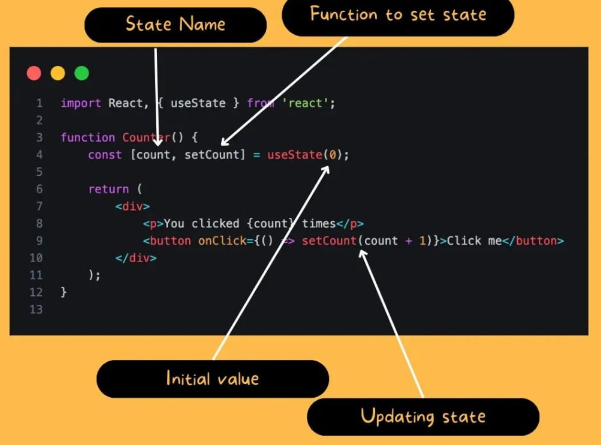
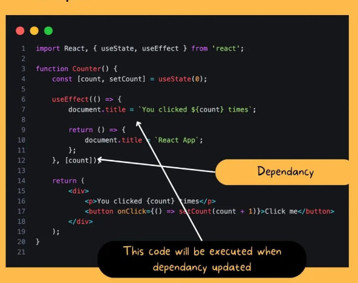
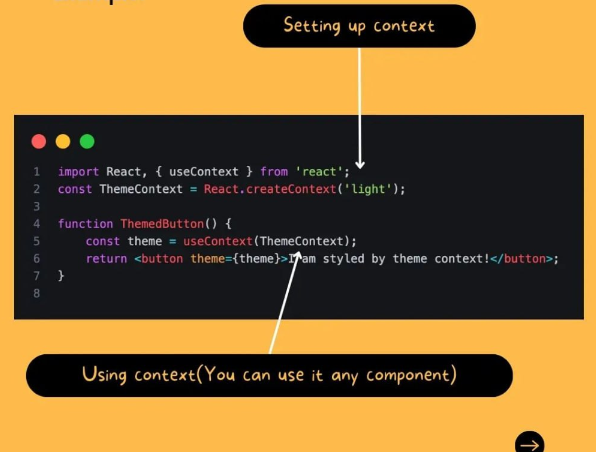
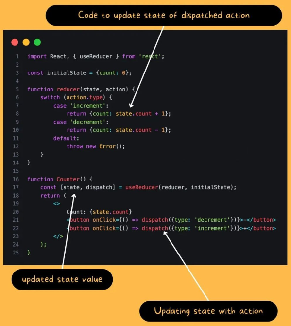
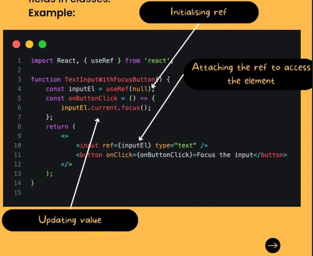

# React Hooks

React Hooks are built-in functions that allow you to use state and other React features, like lifecycle methods and context, in functional components without needing to write a class component.

- **useState**: This Hook allows you to add state to functional components. The useState Hook returns a pair: the current state and a function that updates it.

## Example of Using the useState Hook

- **useEffect**: This Hook allows you to perform side effects in functional components. It is a close replacement for componentDidMount, componentDidUpdate, and componentWillUnmount in class components.

## Example of Using the useEffect Hook

- **useContext**: This Hook allows you to subscribe to React context without introducing nesting. It accepts a context object and returns the current context value for that context.

## Example of Using the useContext Hook

- **useReducer**: This Hook is an alternative to useState. It accepts a reducer of type `(state, action) => newState`, and returns the current state paired with a dispatch method.

### Example

It is particularly useful when the state logic is complex and involves multiple sub-values, or when the next state depends on the previous one. `useReducer` excels at handling more complex, interconnected state that involves multiple changes in an atomic and predictable manner.

## Example of Using the useReducer Hook

- **useRef**: This Hook creates a mutable ref object whose current property is initialized to the passed argument. It's handy for keeping any mutable value around, similar to how you'd use instance fields in classes.

## Example of Using the useRef Hook

## Benefits of React Hooks

- **Simplicity**: Hooks simplify the codebase by allowing developers to reuse stateful logic across multiple components without using class components.
- **Readability**: With Hooks, functional components become more readable and easier to understand compared to class components.
- **Code Reusability**: Hooks encourage code reusability by separating concerns and allowing custom hooks to encapsulate complex logic.
- **Improved Performance**: Hooks can improve performance by optimizing component re-renders and avoiding unnecessary renders.
