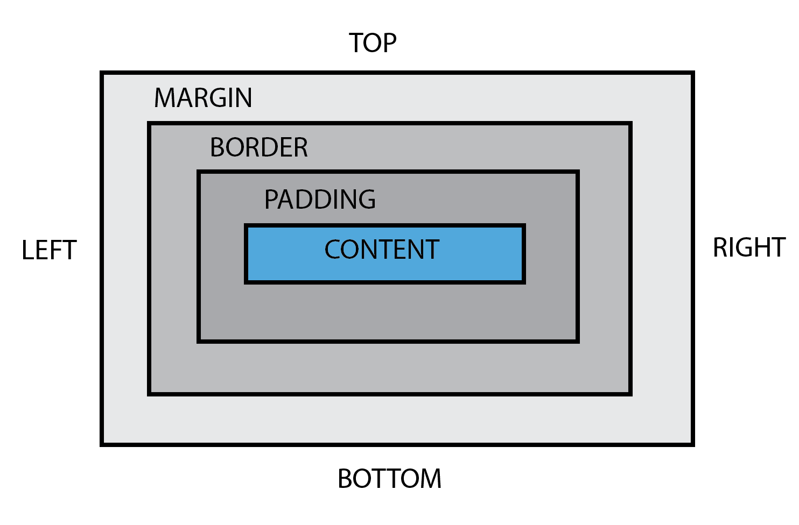

# Box Model Introduction

In CSS, the Box Model is a fundamental concept that defines how elements are rendered and spaced in a web page. Every element in a document is considered a rectangular box, and the Box Model comprises various components that determine the size, spacing, and layout of these boxes.

## Components of the Box Model:

1. **Content:**

   - The actual content of the element, such as text, images, or other media, is contained within the content box.

2. **Padding:**

   - Padding is the space between the content and the border. It adds internal spacing to the element.

3. **Border:**

   - The border surrounds the content and padding. It can have a defined style, color, and width.

4. **Margin:**
   - Margin is the space outside the border. It creates separation between the element and its neighboring elements.

## Box Model Diagram:



## Impact on Layout:

Understanding the Box Model is crucial for controlling the layout and spacing of elements on a webpage. By adjusting the padding, border, and margin, developers can create visually appealing and well-organized designs.

## Example:

```html
<!DOCTYPE html>
<html lang="en">
  <head>
    <meta charset="UTF-8" />
    <meta name="viewport" content="width=device-width, initial-scale=1.0" />
    <title>Box Model Example</title>
    <style>
      /* Styling the box */
      div {
        width: 200px;
        height: 100px;
        padding: 20px;
        border: 2px solid #333;
        margin: 20px;
      }
    </style>
  </head>
  <body>
    <div>This is a box with padding, border, and margin.</div>
  </body>
</html>
```
