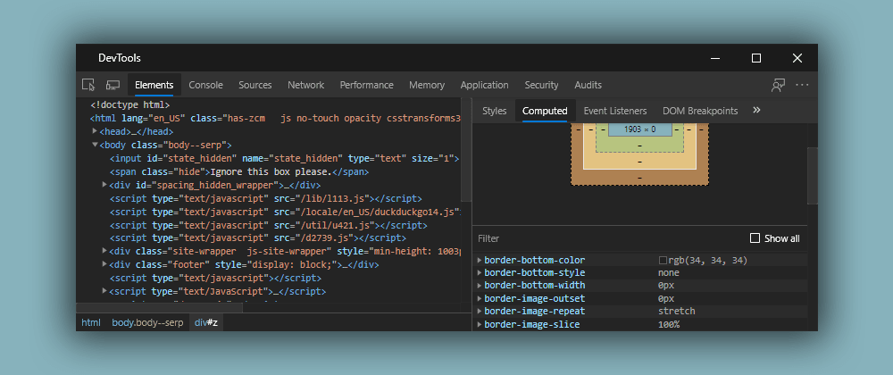

# Browser Developer Tools

Browser Developer Tools are a set of utilities provided by web browsers to assist developers in debugging, testing, and optimizing web pages. These tools offer insights into the structure and behavior of web applications, allowing developers to identify and fix issues efficiently.

## Accessing Developer Tools:

1. **Keyboard Shortcuts:**

   - Most browsers support keyboard shortcuts to open developer tools. Common shortcuts include `Ctrl + Shift + I` (Windows/Linux) or `Cmd + Option + I` (Mac).

2. **Right-Click Menu:**

   - Right-click on an element on the page and select "Inspect" or "Inspect Element" to open the developer tools focused on that element.

3. **Browser Menu:**
   - Navigate to the browser menu (usually represented by three dots or lines), go to "More Tools," and select "Developer Tools."

## Key Features:

1. **Elements Panel:**

   - Allows inspection and modification of HTML and CSS. Developers can view and edit the DOM (Document Object Model) and styles associated with each element.

2. **Console:**

   - Provides an interactive JavaScript console for testing code snippets, logging messages, and debugging scripts. Errors and warnings are displayed here.

3. **Network Panel:**

   - Monitors network activity, displaying requests and responses. Developers can analyze loading times, view HTTP headers, and identify potential performance bottlenecks.

4. **Sources Panel:**

   - Facilitates debugging of JavaScript code. Developers can set breakpoints, inspect variables, and step through code execution.

5. **Performance Panel:**

   - Offers insights into the performance of web pages, measuring loading times, CPU usage, and other metrics. Useful for optimizing site speed.

6. **Application Panel:**

   - Provides information about service workers, caches, and storage. Developers can manage local storage, session storage, and cookies.

7. **Security Panel:**
   - Highlights security-related information, such as HTTPS status, mixed content warnings, and certificate details.

## Utilizing Developer Tools:

1. **Inspecting Elements:**

   - Hover over elements in the "Elements" panel to highlight corresponding areas on the page. This helps identify the structure of the DOM.

2. **Console Commands:**

   - Use the console for executing JavaScript commands, logging outputs, and debugging code. Common commands include `console.log()`, `console.error()`, and `console.table()`.

3. **Network Analysis:**

   - Analyze network requests in the "Network" panel to optimize page loading times. Identify slow or large requests and check for unnecessary resources.

4. **Code Debugging:**

   - Utilize the "Sources" panel for debugging JavaScript code. Set breakpoints, inspect variables, and understand the flow of code execution.

5. **Performance Optimization:**
   - Use the "Performance" panel to identify areas for performance improvement. Measure loading times, identify bottlenecks, and optimize critical rendering paths.

## Example:

In this example, the "Elements" panel displays the HTML structure, the "Console" panel logs a message, and the "Network" panel shows network requests.

Browser Developer Tools are powerful aids for web developers, offering a range of functionalities to enhance the development and debugging process.
