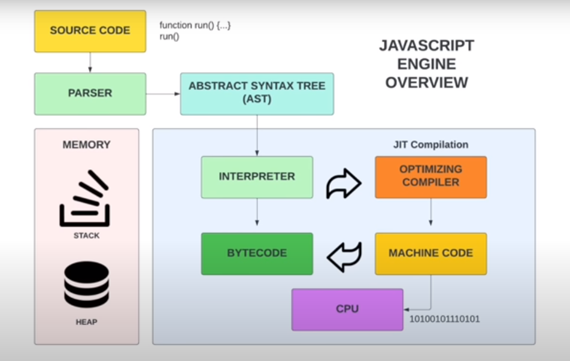

# Compilation Process of JavaScript Code

## From Developer's Editor to JS Engine

After a program leaves a developer's editor, it undergoes several transformations before being executed by a JavaScript (JS) engine:

### 1. Transpilation by Babel

- **Description:** Babel is a popular tool used to convert modern JavaScript code (written using the latest language features) into backward-compatible versions that can run on older browsers or environments. This process is known as **transpilation**.
- **Output:** Transpiled JavaScript code.

### 2. Packaging by Webpack (and Other Build Processes)

- **Description:** Webpack is a module bundler commonly used in modern JavaScript development. It takes the transpiled code from Babel, along with other project files (stylesheets, images, etc.), and bundles them into a single output file or multiple files, ready for deployment.
- **Output:** Bundled JavaScript files along with other assets.

---

## Processing by JS Engine

Once the bundled JavaScript code is delivered to a JS engine, the following steps occur:

### 3. Parsing (Tokenization and AST Generation)

- **Tokenization (Lexical Analysis):** During this phase, the code is broken down into smaller units called **tokens**. Each token represents a specific syntactical element (e.g., variables, operators, or keywords).
- **Syntax Analysis (AST Generation):** The tokens are used to create an **Abstract Syntax Tree (AST)**, which represents the syntactic structure of the code. This step also checks for **syntax errors** in the program.
- **Output:** AST representation of the code.

### 4. Conversion to Intermediate Representation (IR)

- **Description:** The AST is converted into a **binary intermediate representation (IR)**, which is a more efficient form of the code. This intermediate form is used by the engine for further optimizations and quick execution.
- **Output:** Binary Intermediate Representation (IR) of the code.

### 5. Optimization by JIT Compiler

- **Description:** The **Just-In-Time (JIT) compiler** optimizes the IR by applying various optimization techniques, such as function inlining, loop unrolling, and dead code elimination. This step ensures that the code runs as efficiently as possible during execution.
- **Output:** Optimized IR ready for execution.

### 6. Execution by JavaScript Virtual Machine (VM)

- **Description:** Finally, the optimized IR is executed by the **JavaScript Virtual Machine (VM)**. The VM reads the IR, allocates memory, and executes the instructions specified by the optimized IR. This process results in the actual execution of the JavaScript program, producing the desired output.
- **Output:** Result of program execution.

---

## Visual Representation of JS Engine Processing

---

## Key Takeaways

- **Tokenization:** Part of the parsing phase, breaking code into recognizable units (tokens).
- **Syntax Analysis:** Uses tokens to generate an Abstract Syntax Tree (AST) and checks for syntax errors.
- **Intermediate Representation (IR):** A binary representation that allows further optimization.
- **Just-In-Time (JIT) Compilation:** Optimizes code for better performance before execution.
- **Execution:** The final step where the JavaScript program is run, yielding the output.

This comprehensive process ensures that JavaScript code, from the developer’s editor to execution, is both efficient and optimized for performance.

TO Do

- turbofan
- ignition
- optimization techniques
